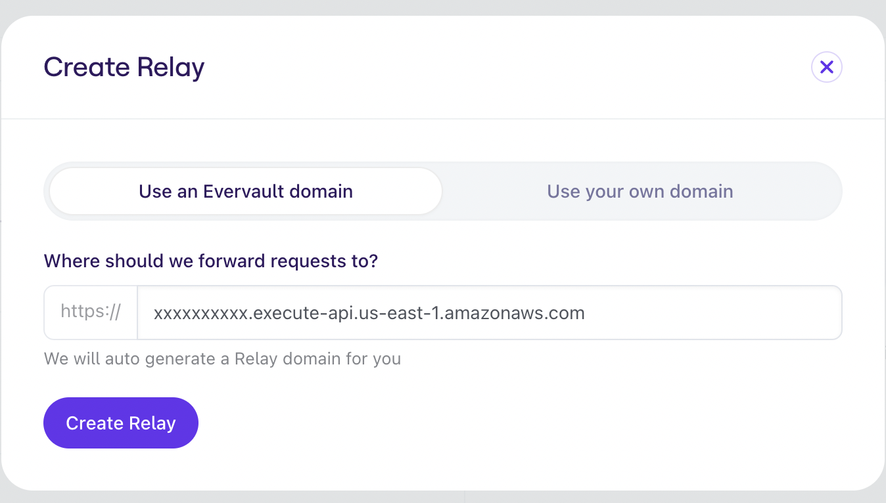
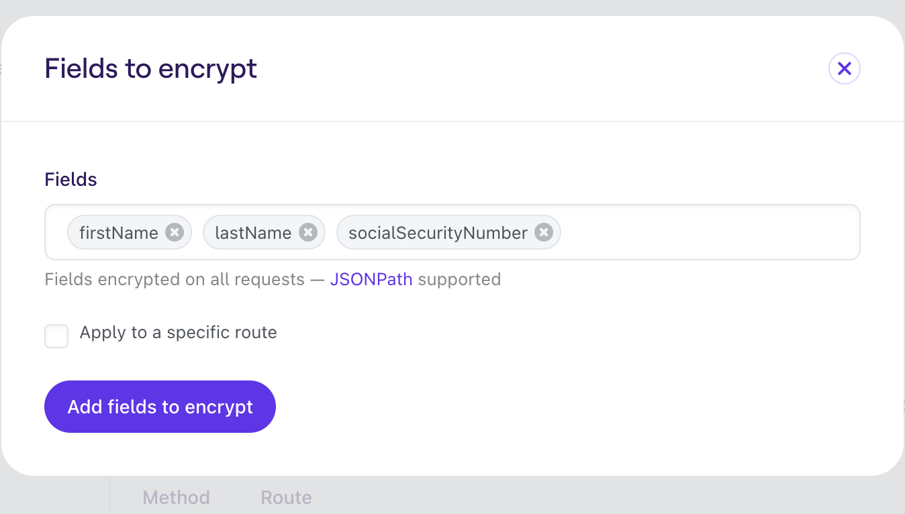

<!--
title: 'Evervault Relay Example'
description: 'This example demonstrates how to use the inbound relay in the Evervault SDK.'
layout: Doc
platform: AWS
language: nodeJS
authorLink: 'https://github.com/evervault'
authorName: 'Evervault Limited'
authorAvatar: 'https://avatars.githubusercontent.com/u/47702631?s=200&v=4'
-->
[](https://evervault.com/)

# Evervault Outbound Relay Example Code

This example demonstrates how easy it is to use the inbound relay feature in the Evervault SDK to securely store your customer's personal data in a database.
In place of setting up an actual database this function simply prints data to STDOUT, however it could easily be adapted to write to a database server.

## Usage

### Account Setup
This example uses [Serverless](https://www.serverless.com/) to automate the setup and deployment of the cloud functions for you. To proceed you'll need to setup the Serverless CLI, just follow [the guide on their website](https://www.serverless.com/framework/docs/getting-started) and return here once you're done.

To use this example you'll also need to have an Evervault team, if you don't already have one go to [app.evervault.com](https://app.evervault.com/login) and either create an account or sign in with Google or GitHub. When your account is created a personal team is created for you automatically.

Now you're all set!

### Deployment

Simply run:

```
$ serverless deploy
```

Assuming that all is well in your configuration you should see an output similar to:

```bash
Deploying evervault-outbound-relay-example to stage dev (us-east-1)

✔ Service deployed to stack evervault-outbound-relay-example-dev (126s)

endpoint: POST - https://xxxxxxxxxx.execute-api.us-east-1.amazonaws.com/
functions:
  evRelayExample: evervault-outbound-relay-example-dev-evRelayExample (2.8 MB)
```

Now you need to setup the Evervault relay.
On the Evervault dashboard click the plus symbol on the top right of the relay column and a 'Create Relay' screen should appear.
Copy the endpoint that was given to you in the last step in to the URL box and click 'Create Relay'.



Click 'Continue to your Relay page' to continue with the setup.
We now need to specify which fields are encrypted when they are sent through the relay.
Nagivate to the 'Encrypted Fields' section and click 'Add fields' in the to right.
Add `firstName, lastName, socialSecurityNumber` to the list of fields.
Type them all seperately with a comma between them.
See the image below to see how it should look once configured correctly.



Now all that's left to do is copy your `Relay Domain` from the General tab.


### Invocation

After successful deployment, you can call your function with curl:

```bash
curl -X POST <Your Relay Domain>   -H "Content-Type: application/json" -d '{"firstName": "Claude", "lastName": "Shannon", socialSecurityNumber: 123456}'  
```

Looking at the output on its own you wouldn't think that much has happened. However its when you look at the logs that its apparent what Relay did.

To view your serverless logs simply run:

```bash
serverless logs -f evRelayExample
```

As you can see by the logs, your function never even saw your users private data.
It was automatically encrypted and decrypted by Relay!


Sample Serverless logs:
```
2022-06-15 17:48:30.635 INFO    First Name: ev:Tk9D:KiLpLlOKN8UkldLs:A794jjWH4OQGMks7JRvFNdguebaynrGxXmk+AXP8OXgW:J+sUwWUZVvVvIDW3jS5euvCnuIw=:$, Last Name: ev:Tk9D:60qWSlFyCnUfuXh+:AvIEg58CcE4l/kFWi/K8vCreaniHwgPzIcbu8tzCTNgt:gDvwMbv6V4EdjEa43owVciitR6EJ:$, SSN: ev:Tk9D:TWtEHcXvu3sD1GlZ:AlOwRm5KUjX4UNLJFA7R4in3Iz05B0hkpjV6aRrzgM2C:+Ww4iF8JqXpIAamb9vYPNj2PuC1vpg==:$                                             
```
