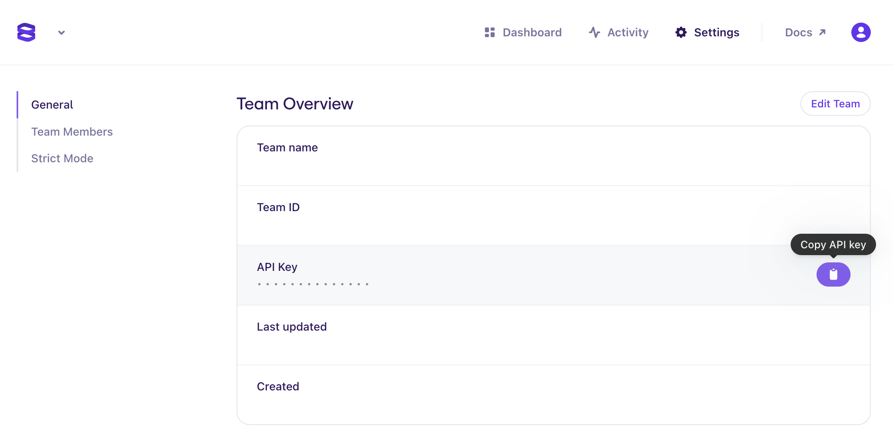

<!--
title: 'Evervault Relay Example'
description: 'This example demonstrates how to use the outbound relay in the Evervault SDK.'
layout: Doc
platform: AWS
language: nodeJS
authorLink: 'https://github.com/evervault'
authorName: 'Evervault Limited'
authorAvatar: 'https://avatars.githubusercontent.com/u/47702631?s=200&v=4'
-->
[](https://evervault.com/)

# Evervault Outbound Relay Example Code

This example demonstrates how easy it is to use the outbound relay feature in the Evervault SDK to decrypt your customer's data before sending it to be securely processed by third parties.

## Usage

### Setup
This example uses [Serverless](https://www.serverless.com/) to automate the setup and deployment of the cloud functions for you. To proceed you'll need to setup the Serverless CLI, just follow [the guide on their website](https://www.serverless.com/framework/docs/getting-started) and return here once you're done.

To use this example you'll also need to have an Evervault team, if you don't already have one go to [app.evervault.com](https://app.evervault.com/login) and either create an account or sign in with Google or GitHub. When your account is created a personal team is created for you automatically.

Now you'll need to fetch your API Key and paste it in to the `EVERVAULT_API_KEY` environment variable in the `serverless.yml` file to authenticate you.

To get it, click 'Settings' in the Navigation Bar in Evervault and you should see 'API Key' as a field under 'Team Overview', simply copy it and paste it in to `serverless.yml`



You're almost ready to run the example but there's just one bit of setup left to do. You'll need to create an endpoint to send the data to so you can view it in all its decrypted glory. There are a number of free services that allow you to create endpoints to post traffic to, one example is [requestbin.com](https://requestbin.com/). Once you have generated your request bin link simply copy the link to your endpoint and paste it in as the `REQUEST_URL` parameter in `serverless.yml`

Now you're all set!

### Deployment

Simply run:

```
$ serverless deploy
```

Assuming that all is well in your configuration you should see an output similar to:

```bash
Deploying evervault-outbound-relay-example to stage dev (us-east-1)

✔ Service deployed to stack evervault-outbound-relay-example-dev (126s)

endpoint: POST - https://xxxxxxxxxx.execute-api.us-east-1.amazonaws.com/
functions:
  evRelayExample: evervault-outbound-relay-example-dev-evRelayExample (2.8 MB)
```

### Invocation

After successful deployment, you can call your function with curl:

```bash
curl -X POST https://xxxxxxxxxx.execute-api.us-east-1.amazonaws.com/   -H "Content-Type: application/json" -d '{"creditCardNumber": 4242424242424242}'  
```

Look at the ouptut from curl and notice how the transaction details have been encrypted by Evervault.

Now look at the body of the request sent to your request bin, since outbound relay was active (by setting `intercept` to true in the sdk options) the fields were all decrypted by relay before being sent onwards to their final destination.

Sample CURL output:
```json
{
  "creditCardNumber":"ev:RFVC:xERV9BCk0cpFa3WK:AyiUKjVd1JPjf+UEPWOD0DIW5ACm5OllNnX/MFWGxxFY:fLVQBeBx7fEaiqqjP3z7xinAWAMwMGU6rgF31Y9y2SpdBIrN:$",
  "transaction":{
    "transactionConfirmationCode":"ev:RFVC:number:YuWm73MZE3JHh+u/:AvoxqQ9wGatG35MVpeuzpuoOLGPhHhIsd+P1NrqBcjWm:LfSSGlS/fkE1DHKSJMc5+s9HAdZaPgg:$",
    "timestamp":"ev:RFVC:number:82pDf11hbkPZK8M7:AvoxqQ9wGatG35MVpeuzpuoOLGPhHhIsd+P1NrqBcjWm:tY/GSiekw5orP0eM+qSgi6/8m2tCbQU7VYxu6tg:$"
    }
  }                                                 
```

Sample Request Bin:
```json
{
  "creditCardNumber":4242424242424242,
  "transaction":{
    "transactionConfirmationCode":2445148,
    "timestamp":1655223946545
    }
  }                                                 
```
